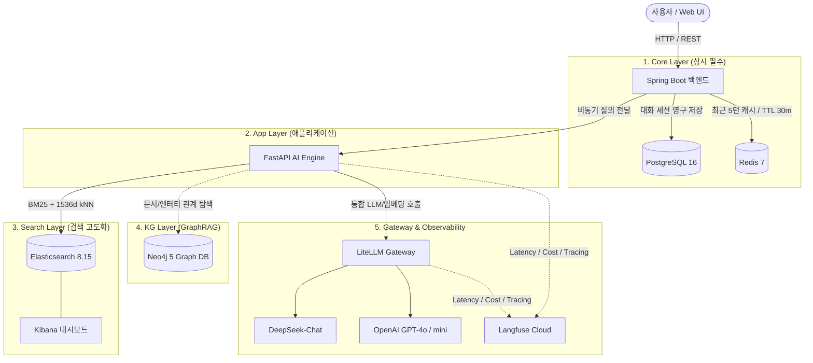

# Confluence Knowledge Base RAG Chatbot

> **실무형 확장을 고려한 단계별 모듈러 RAG & GraphRAG 시스템**  
> 사내 Confluence 문서를 지능적으로 검색하고 정확한 출처와 함께 신뢰할 수 있는 답변을 제공하는 엔터프라이즈 지식 기반 챗봇 프로젝트입니다.

---

## 🎯 프로젝트 핵심 방향 (Core Architecture Vision)

본 프로젝트는 단순히 여러 도구를 나열하는 방식에서 벗어나, **제한된 자원(PoC/개인 개발 환경)에서 실무적으로 필요한 컴포넌트를 선별하고 단계적으로 확장 가능한 계층형 아키텍처(Modular Layered Architecture)**를 설계하는 데 중점을 두었습니다.

- **역할 기반 컴포넌트 분리**: 각 도구의 존재 이유와 트레이드오프를 정의하고, 상시 필수 구성과 선택적 구성을 구분했습니다.
- **Docker Compose 계층 분리**: `Core`, `App`, `Search`, `KG`, `Observability` 계층으로 분리하여 개발 목적과 서버 자원에 맞춰 필요한 서비스만 선별적으로 구동할 수 있습니다.
- **실무형 운영성 고려**: Polyglot Persistence(세션 캐시 + 영구 저장), Dynamic Model Routing & Fallback, OTel 기반 실시간 트레이싱을 적용했습니다.

---

## 🏗️ 시스템 아키텍처 및 계층별 구성 (Layered Architecture)



### 📊 계층별 역할 및 리소스 매트릭스 (Resource Matrix)

| 계층 (Layer) | Docker Compose 파일 | 주요 서비스 | 상시 구동 여부 | 역할 및 채택 근거 | 메모리 풋프린트 |
|---|---|---|---|---|---|
| **Core** | `docker-compose.yml` | `postgres`<br>`redis` | **필수 (상시)** | • 대화방 및 메시지 영구 적재 (RDB)<br>• 최근 5턴 대화 맥락 고속 캐싱 (In-Memory) | ~0.5GB - 1.0GB |
| **App** | `docker-compose.app.yml` | `backend`<br>`ai-server` | **상시 (로컬/컨테이너)** | • 비즈니스 로직 및 세션 관리 (Spring Boot 3)<br>• Hybrid Search & RAG 파이프라인 (FastAPI) | ~0.8GB - 1.5GB |
| **Search** | `docker-compose.search.yml` | `elasticsearch`<br>`kibana` | **선택적 구동**<br>(검색 평가/색인 시) | • Nori 형태소 분석(BM25) + 1536차원 벡터(kNN) 하이브리드 검색<br>• 인덱스 디버깅 및 분석 (Kibana) | ~2.5GB - 3.0GB |
| **KG** | `docker-compose.kg.yml` | `neo4j` | **선택적 구동**<br>(GraphRAG 실험 시) | • 문서 간 링크 및 엔터티 계층 그래프 저장<br>• 멀티홉 관계 추론 질의 지원 | ~1.5GB - 2.0GB |
| **Obs / Gateway** | `docker-compose.obs.yml` | `litellm` | **선택적 구동**<br>(다중 모델/장애 대응 시) | • 단일 OpenAI 규격 인터페이스, 모델 동적 라우팅 및 Fallback<br>• Langfuse Cloud 연동을 통한 무부하 OTel 트레이싱 | ~0.5GB - 0.8GB |

> 💡 각 아키텍처 설계에 대한 상세 의사결정 기록(ADR)은 [docs/ARCHITECTURE.md](docs/ARCHITECTURE.md)에서 확인하실 수 있습니다.

---

## 💡 핵심 엔지니어링 포인트

### 1. Polyglot Persistence 기반 세션 분리
- **Redis**: 실시간 대화 흐름을 위해 최근 5턴 대화 내역을 인메모리 캐싱(TTL 30분, `allkeys-lru`)하여 LLM 프롬프트에 즉시 주입, 데이터베이스 I/O 병목을 제거했습니다.
- **PostgreSQL**: 대화방 목록과 전체 메시지 이력을 RDB에 영구 보존하여 과거 대화 복원 및 감사(Audit) 추적이 가능합니다.

### 2. 고정밀 하이브리드 검색 (BM25 + Dense Vector kNN)
- Confluence HTML 본문의 표(`<table>`)를 마크다운 표 구조로 보존하여 정보 왜곡을 방지했습니다.
- Nori 한국어 형태소 분석기를 적용한 **키워드 검색(BM25, 제목 가중치 2배)**과 **1536차원 Dense Vector 코사인 유사도(kNN)**를 결합했습니다.
- 서로 다른 점수 범위를 Min-Max 정규화한 후 가중 합산($\text{BM25}:3.0 + \text{kNN}:7.0$)하여 사내 전문 용어와 문맥적 의미를 동시에 포착합니다.
- 동일 문서 청크 중복을 제거하고 문서 전체 맥락을 온전히 컨텍스트에 포함하도록 후처리합니다.

### 3. 질문 특성 기반 동적 모델 라우팅 & Fallback (LiteLLM)
- **동적 모델 라우팅**: 질문 길이가 12자 미만(의도 파악 필요)이거나 1000자 이상(긴 맥락)인 경우 고성능 `GPT-4o`로 분기하고, 일반 질의는 경제적인 `DeepSeek-Chat`을 활용하여 안정성과 비용을 최적화했습니다.
- **장애 자동 대응 (Fallback)**: 주 모델 응답에 일시적 지연이나 오류 발생 시 보조 모델(`GPT-4o-mini`)로 자동 우회하여 무중단 서비스를 보장합니다.

### 4. 무부하 옵저버빌리티 & 트레이싱 (Langfuse Cloud)
- 무거운 모니터링 컨테이너를 로컬에 직접 띄우지 않고 Langfuse Cloud와 연동하여 자원 소모를 최소화했습니다.
- 질의 처리 소요 시간(Latency), 토큰 사용량, 예상 비용, 검색된 문서 출처 메타데이터를 실시간으로 추적합니다.

---

## 🚀 단계별 실행 가이드 (Tiered Quick Start)

### ⚙️ 0. 환경 설정
`.env.example`을 복사하여 `.env` 파일을 생성하고 필요한 API Key 및 패스워드를 입력합니다.
```bash
cp .env.example .env
```

---

### [Tier 1] 기본 로컬 개발 환경 (Core: ~1GB RAM)
Postgres와 Redis만 Docker로 띄우고, 앱 코드는 IDE나 터미널에서 직접 실행하여 빠른 개발 사이클을 유지합니다.

```bash
# 1. Core 인프라(PostgreSQL, Redis) 기동
docker compose up -d

# 2. Python AI 서버 실행 (터미널 1)
cd ai-server
pip install -r requirements.txt
uvicorn app.main:app --port 8000 --reload

# 3. Spring Boot 백엔드 실행 (터미널 2)
cd backend
./gradlew bootRun
```
* 브라우저 접속: **`http://localhost:8080`**

---

### [Tier 2] 검색 고도화 및 하이브리드 검색 실험 (~3.5GB RAM)
Elasticsearch 8.15(Nori 플러그인)와 Kibana 대시보드를 추가하여 문서 색인 및 검색 품질을 평가합니다.

```bash
# Core + Search 레이어 기동
docker compose -f docker-compose.yml -f docker-compose.search.yml up -d

# Confluence 문서 색인 실행 (ai-server)
cd ai-server
python scripts/ingest.py

# RAG QA 성능 평가 실행
python evaluation/run_qa.py
```
* Kibana 대시보드: **`http://localhost:5601`**

---

### [Tier 3] Knowledge Graph (GraphRAG) 확장 실험 (~2.5GB RAM)
문서 간 관계 탐색 및 엔터티 연결을 검증할 때 Neo4j를 추가합니다.

```bash
# Core + KG 레이어 기동
docker compose -f docker-compose.yml -f docker-compose.kg.yml up -d
```
* Neo4j Browser: **`http://localhost:7474`** (기본 계정: `neo4j` / `kg-password`)

---

### [Tier 4] 전체 풀스택 통합 구동 (Full Stack Integration)
데모 시연 또는 전체 파이프라인 통합 테스트 시 모든 컨테이너를 일괄 실행합니다.

```bash
docker compose \
  -f docker-compose.yml \
  -f docker-compose.app.yml \
  -f docker-compose.search.yml \
  -f docker-compose.kg.yml \
  -f docker-compose.obs.yml \
  up -d
```

> 📖 **DB 직접 접속(psql/redis-cli), 로그 확인, 색인/평가 스크립트, 리셋 등 모든 상세 명령어**는 **[docs/COMMANDS.md](docs/COMMANDS.md)**에 일목요연하게 정리되어 있습니다.

---

## 📂 프로젝트 디렉터리 구조

```text
├── docker-compose.yml          # [Core] PostgreSQL, Redis 및 공통 네트워크 정의
├── docker-compose.app.yml      # [App] Spring Boot 백엔드, FastAPI AI 서버
├── docker-compose.search.yml   # [Search] Elasticsearch 8.15 (Nori), Kibana, Setup
├── docker-compose.kg.yml       # [KG] Neo4j 5 Graph Database
├── docker-compose.obs.yml      # [Observability] LiteLLM 라우팅 게이트웨이
├── backend/                    # Spring Boot 백엔드 (Java 21)
│   ├── src/main/java/          # Controller, Service, Repository, DTO
│   └── Dockerfile              # Multi-stage JDK 21 JRE 빌드
├── ai-server/                  # FastAPI AI 엔진 (Python 3.12)
│   ├── app/
│   │   ├── api/v1/chat.py      # 비동기 RAG 채팅 API 라우터
│   │   ├── retrieval/          # Elasticsearch 하이브리드 검색 클라이언트
│   │   ├── llm/                # LiteLLM 연동, 프롬프트, 동적 모델 라우팅
│   │   └── parser/             # Confluence HTML 마크다운 파서
│   ├── evaluation/             # RAG QA 평가 데이터셋 및 벤치마크 스크립트
│   ├── scripts/ingest.py       # Confluence 증분/전체 색인 스크립트
│   └── Dockerfile              # 경량 Python 3.12-slim 빌드
├── elasticsearch/              # Nori 형태소 분석기 커스텀 Dockerfile & 인증서
├── litellm/                    # LiteLLM 다중 모델 및 Fallback 라우팅 설정
└── docs/                       # 상세 아키텍처 설계 문서 및 ADR
    ├── ARCHITECTURE.md         # Architecture Decision Records & 리소스 분석
    └── COMMANDS.md             # Docker 및 개발/디버깅 통합 명령어 치트시트
```

---

## 🚢 배포 및 확장성 로드맵 (Production Roadmap)

1. **Vercel 프론트엔드 배포**: 포트폴리오 데모용 웹 UI를 Vercel Edge Network에 배포하여 글로벌 CDN 캐싱 및 응답 속도 최적화
2. **저비용 VPS 백엔드 배포**: 가상 인스턴스(1 Core / 2GB RAM)에 Core 및 App 계층만 배포하여 호스팅 비용을 최소화
3. **Managed Search/Graph 전환**: 트래픽 증가 시 Elastic Cloud 및 Neo4j Aura와 연동하여 관리 부담 없이 무중단 스케일아웃 지원
