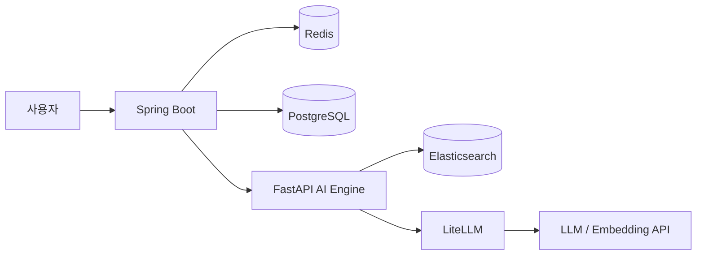

# Confluence RAG Chatbot

Confluence 문서를 수집해 Elasticsearch에 색인하고, 하이브리드 검색 결과를 근거로 답변하는 사내 문서 챗봇입니다.

## 구성



| 계층 | Compose 파일 | 서비스 |
|---|---|---|
| Core | `docker-compose.yml` | PostgreSQL, Redis |
| Search | `docker-compose.search.yml` | Elasticsearch, Kibana |
| Gateway | `docker-compose.obs.yml` | LiteLLM |
| App | `docker-compose.app.yml` | FastAPI, Spring Boot |

검색은 Elasticsearch의 Nori BM25와 Dense Vector kNN 점수를 결합합니다. 답변에는 사용한 Confluence 문서 출처를 함께 반환합니다.

## 실행

1. 저장소 루트에 `.env`를 준비합니다.
2. 전체 서비스를 시작합니다.

```bash
docker compose \
  -f docker-compose.yml \
  -f docker-compose.search.yml \
  -f docker-compose.obs.yml \
  -f docker-compose.app.yml \
  up -d --build
```

3. Confluence 문서를 색인합니다.

```bash
docker exec -it rag-ai-server python -m scripts.ingest
```

4. `http://localhost:8080`에서 사용합니다.

주요 상태 확인:

```bash
curl http://localhost:8000/internal/health
```

## 주요 환경 변수

| 변수 | 용도 |
|---|---|
| `CONFLUENCE_BASE_URL` | Confluence 주소 |
| `CONFLUENCE_SPACE_KEY` | 색인할 Space 키 |
| `CONFLUENCE_EMAIL` | Confluence 계정 이메일 |
| `CONFLUENCE_API_TOKEN` | Confluence API 토큰 |
| `ELASTIC_PASSWORD` | Elasticsearch 비밀번호 |
| `LITELLM_BASE_URL` | LiteLLM 주소 |
| `OPENAI_API_KEY` | 임베딩 모델 호출 |
| `DEEPSEEK_API_KEY` | 기본 답변 모델 호출 |

실제 비밀값은 Git에 커밋하지 않습니다.

## 디렉터리

```text
ai-server/      FastAPI, 수집, 검색, LLM 파이프라인
backend/        Spring Boot API, 세션, Web UI
elasticsearch/  Nori 포함 Elasticsearch 이미지
litellm/        LiteLLM 모델 라우팅 설정
docs/           운영·설계 문서
notebooks/      파서와 검색 실험
```

자세한 내용은 `docs/ARCHITECTURE.md`, `docs/COMMANDS.md`, `docs/ELASTICSEARCH.md`를 참고합니다.
