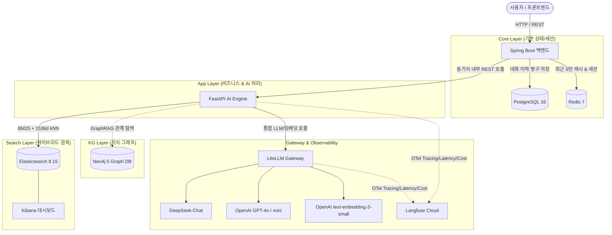

# Architecture Decision Records & System Design

> **핵심 가치**: 제한된 서버 자원(PoC/개인 개발 환경)에서 실무적으로 필요한 컴포넌트를 선별하고, 각 컴포넌트의 역할과 트레이드오프를 명확히 정의하여 단계적으로 확장 가능한 **모듈러 계층형 RAG 아키텍처(Modular Layered RAG Architecture)**를 구현합니다.

---

## 1. 전체 시스템 아키텍처 (System Overview)

---

## 2. 계층별 리소스 매트릭스 및 트레이드오프

| 계층 (Layer) | 구성요소 | 역할 | 상시 필수 여부 | 필요성 및 배제 가능 시점 (Trade-offs) | 권장 메모리 |
|---|---|---|---|---|---|
| **Core** | `PostgreSQL` `Redis` | • 대화방 및 전체 메시지 영구 보관 • 최근 5턴 대화 맥락 고속 캐싱 (TTL 30m) | **필수 (상시)** | • 서비스 기본 운영에 필수 • 영구 RDB와 고속 인메모리 캐시의 역할 분리 | ~0.5GB - 1.0GB |
| **App** | `Spring Boot` `FastAPI` | • 비즈니스 API와 세션 오케스트레이션 • Retrieval, Model Routing, RAG 파이프라인 | **필수 (상시)** | • 백엔드와 AI 처리 역할 분리 • 로컬 개발 시에는 호스트에서 직접 실행 가능 | ~0.8GB - 1.5GB |
| **Search** | `Elasticsearch` `Kibana` | • Nori 한국어 형태소 분석 (BM25) • 1536차원 Dense Vector 코사인 유사도 (kNN) • 인덱스 디버깅 및 시각화 (Kibana) | **ES 필수 / Kibana 선택** | • Elasticsearch는 현재 RAG 채팅의 기본 검색엔진 • Kibana는 색인·검색 디버깅 시에만 필요 | ~2.5GB - 3.0GB |
| **KG** | `Neo4j` | • 문서 간 링크, 작성자, 상하위 계층 그래프 모델링 • 멀티홉 관계 추론 및 GraphRAG | **현재 필수** (GraphRAG 유지 결정 대기) | • 현재 채팅 파이프라인이 매 요청에서 관계 맥락 조회 • GraphRAG를 제외하면 런타임 의존성도 함께 제거 가능 | ~1.5GB - 2.0GB |
| **Gateway & Obs** | `LiteLLM` `Langfuse Cloud` | • LLM·임베딩 단일 OpenAI 규격 라우팅 및 Fallback • Latency, Token 수, 예상 비용, Trace 관측 | **LiteLLM 필수 / Langfuse 선택** | • LiteLLM은 현재 AI 호출의 단일 관문 • Langfuse는 별도 로컬 관측 서버 없이 선택적으로 사용 | ~0.5GB - 0.8GB |

---

## 3. Architecture Decision Records (ADR)

### [ADR-001] Polyglot 분리: Spring Boot와 FastAPI 분리
- **Context**: RAG 챗봇 서비스는 사용자 요청, 대화방 관리, 세션 오케스트레이션과 같은 웹 백엔드 역할과 문서 청킹, 임베딩, 벡터 검색, LLM 파이프라인 같은 AI 엔지니어링 역할을 동시에 요구합니다.
- **Decision**: Spring Boot 4.0.7(Java 21)과 FastAPI(Python 3.12)로 백엔드와 AI 엔진의 역할을 분리했습니다.
- **Rationale**:
  - Spring Boot는 트랜잭션과 JPA 기반 RDB 관리, 세션 API를 담당합니다.
  - Python 생태계는 LangChain/LlamaIndex, 형태소 분석, AI SDK와의 호환성이 뛰어납니다.
  - AI 로직과 비즈니스 API를 독립적으로 수정하고 배포할 수 있습니다.

---

### [ADR-002] 검색 아키텍처: 왜 Elasticsearch 하이브리드 검색인가?
- **Context**: 사내 기술 문서(Confluence)는 고유 명사(예: 시스템명, 에러 코드, API 파라미터)와 자연어 설명이 혼합되어 있습니다.
- **Decision**: ChromaDB나 단순 벡터 DB 대신 **Elasticsearch 8.15 (Nori 형태소 분석기 + Dense Vector)**를 단일 저장소로 활용한 하이브리드 검색을 구축했습니다.
- **Rationale**:
  - **벡터 검색의 한계**: 임베딩 모델은 사내 특수 용어나 정확한 코드명을 놓치는 경우가 빈번합니다.
  - **키워드 검색의 한계**: 단순 BM25는 동의어 및 문맥적 의미 파악에 취약합니다.
  - **Elasticsearch 통합 이점**: 별도의 벡터 DB와 키워드 검색 엔진을 이중 관리할 필요 없이 단일 클러스터에서 BM25 점수와 코사인 유사도 점수를 정규화(Min-Max Normalization) 및 가중 합산(BM25:kNN = 3:7)하여 최적의 정확도를 도출합니다.

---

### [ADR-003] Polyglot Persistence: PostgreSQL과 Redis 분리 설계
- **Context**: 멀티턴 챗봇은 빠른 응답 속도와 과거 대화 이력의 영구 보존이라는 상반된 요구조건을 가집니다.
- **Decision**:
  - **Redis 7**: 최근 5턴 대화 맥락을 세션별로 캐싱 (TTL 30분, `allkeys-lru` 메모리 정책). LLM 호출 시 즉시 프롬프트에 주입하여 DB I/O 부하 제거.
  - **PostgreSQL 16**: 대화방 메타데이터 및 전체 대화 기록을 RDB에 영구 적재. 감사(Audit) 및 과거 대화 조회 지원.
- **Rationale**: 캐시 실패 시에도 RDB를 통해 대화 맥락을 즉시 복원할 수 있는 Fallback 구조를 완성했습니다.

---

### [ADR-004] LLM 게이트웨이 & Fallback: LiteLLM 라우팅 전략
- **Context**: 고성능 모델(`GPT-4o`)은 비용과 레이턴시가 높고, 경제적 모델(`DeepSeek-Chat`)은 간혹 복잡한 추론이나 간헐적 API 장애를 겪을 수 있습니다.
- **Decision**: LiteLLM 프록시를 전면에 배치하고 질문 복잡도 기반 **동적 모델 라우팅 및 Fallback**을 적용했습니다.
  - 질의 길이 12자 미만 또는 질의와 최근 대화의 합계가 1000자 이상: `GPT-4o` 라우팅
  - 일반 질의: `DeepSeek-Chat` 라우팅 (비용 절감)
  - `DeepSeek-Chat` 실패 시 `GPT-4o-mini`, `GPT-4o` 실패 시 `DeepSeek-Chat`으로 재시도

---

### [ADR-005] 관측성(Observability): Langfuse Cloud 활용
- **Context**: 자체 호스팅 Langfuse는 추가적인 PostgreSQL, ClickHouse, Web UI 컨테이너 구동으로 약 2GB 이상의 메모리를 소모합니다.
- **Decision**: Langfuse Python SDK 및 LiteLLM 콜백을 통해 **Langfuse Cloud**로 트레이스를 전송하도록 구성했습니다.
- **Rationale**: 로컬 관측 서버의 자원 사용을 피하면서 토큰 수, 지연 시간, 예상 비용과 파이프라인 트레이스를 확인할 수 있습니다.

---

## 4. 확장 및 배포 로드맵 (Production Roadmap)

1. **Phase 1: Local PoC (현재 완성)**
   - Docker Compose 모듈러 구성을 통한 저사양 로컬 개발 및 기능 검증
2. **Phase 2: Low-cost VPS / Cloud Staging**
   - 가상 서버에는 Core/App을 배포하고, 필수 Search와 LiteLLM은 서버 용량에 따라 함께 배포하거나 외부 서비스로 분리
   - 현재 GraphRAG를 유지하면 KG도 함께 배포하고, 제외 결정 시 Neo4j 의존성을 제거
3. **Phase 3: Frontend Serverless 배포 (Vercel)**
   - 포트폴리오용 웹 UI는 Vercel에 정적/SSR 배포하여 CDN 가속 적용
   - 백엔드 REST API 도메인과 HTTPS 통신 연결
