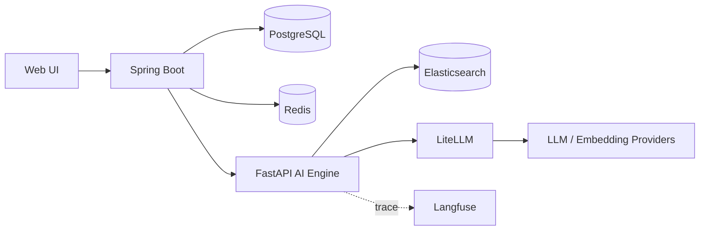

# 아키텍처

## 전체 구조

## 책임

| 구성요소 | 책임 |
|---|---|
| Spring Boot | 외부 채팅 API, 세션·메시지 저장, Web UI 제공 |
| FastAPI | 질문 처리, 검색, 컨텍스트 구성, LLM 호출 |
| Elasticsearch | Confluence 청크와 임베딩 저장, BM25·kNN 검색 |
| LiteLLM | 모델별 API 규격 통합과 라우팅 |
| PostgreSQL | 대화방과 전체 메시지 영속화 |
| Redis | 최근 대화 이력 캐시 |
| Langfuse | LLM 요청의 지연·토큰·비용 추적 |

## 질의 흐름

1. Spring Boot가 세션의 최근 이력을 Redis에서 읽는다.
2. FastAPI가 질문 임베딩을 생성한다.
3. Elasticsearch에서 BM25와 kNN 후보를 각각 검색한다.
4. 두 점수를 0~1로 정규화하고 가중합해 문서 단위 상위 결과를 고른다.
5. 선택한 문서 본문과 대화 이력을 LLM 컨텍스트로 구성한다.
6. 답변과 출처를 Spring Boot에 반환한다.
7. Spring Boot가 메시지를 PostgreSQL과 Redis에 반영한다.

## 배포 계층

- `docker-compose.yml`: PostgreSQL, Redis
- `docker-compose.search.yml`: Elasticsearch, Kibana
- `docker-compose.obs.yml`: LiteLLM
- `docker-compose.app.yml`: FastAPI, Spring Boot

모든 서비스는 `confluence-net` 네트워크에서 서비스 이름으로 통신합니다.
