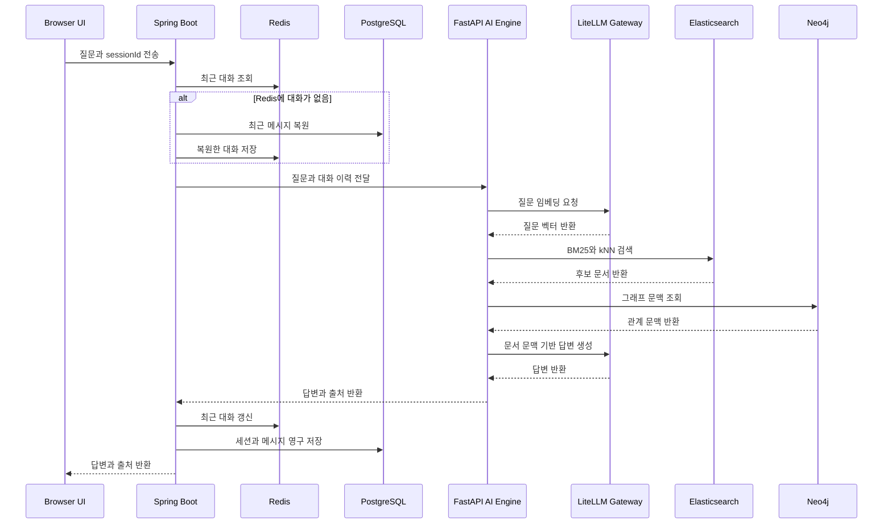

# Confluence RAG Chatbot — 기술·문제 해결 정리

> 이 문서는 포트폴리오와 면접 설명을 위한 사실 기준 문서다. 현재 코드, 설정, 작업 기록을 함께 확인해 작성했다.
> 구현 과정에서 AI가 제안하거나 수행한 작업과 사용자가 직접 내린 판단을 구분하며, 확인되지 않은 내용을 개인의 결정으로 포장하지 않는다.

## 1. 프로젝트 한눈에 보기

사내 Confluence 문서를 수집·가공해 사용자의 자연어 질문에 관련 문서와 출처를 찾아 답하는 RAG 챗봇이다.

단순히 LLM API를 호출하는 것이 아니라 다음 문제를 한 흐름 안에서 다룬다.

- Confluence 특유의 HTML, 표, 내부 링크를 검색 가능한 문서로 변환
- 한국어 키워드 검색과 의미 기반 검색을 함께 사용
- 여러 청크로 나뉜 문서에서 답에 필요한 전체 맥락 복원
- 최근 대화와 영구 대화 이력 분리
- 모델 호출 경로와 관측 도구 분리
- 제한된 VM 자원에서 필요한 서비스만 조합해 실행
- 검색 실패, 생성 실패, 데이터셋 오류를 나눠 평가

## 2. 현재 요청 흐름

현재 코드의 질의 흐름을 나타낸다. Neo4j는 현재 요청 경로에 포함되어 있지만 GraphRAG의 유지 여부와 역할은 아직 최종 결정되지 않았다.

## 3. 기술 스택

| 영역 | 기술 | 현재 역할 |
|---|---|---|
| Web UI | HTML, CSS, Vanilla JavaScript | 채팅, 세션 목록, 출처 표시 |
| UI 보조 | marked.js, DOMPurify | Markdown 렌더링과 렌더링 결과 정화 |
| 애플리케이션 API | Java 21, Spring Boot 4.0.7, Spring MVC | 외부 REST API, 세션 조정, 저장 흐름 관리 |
| 데이터 접근 | Spring Data JPA, Spring Data Redis | 영구 이력과 최근 대화 접근 |
| 내부 HTTP | Spring RestClient | Spring에서 FastAPI 내부 API 호출 |
| AI Engine | Python 3.12, FastAPI, Pydantic | RAG 요청 처리, 검색·생성 조정 |
| HTTP client | HTTPX | LiteLLM의 embedding·chat API 호출 |
| 문서 수집·파싱 | Confluence REST API, BeautifulSoup, pandas | 페이지 수집, HTML·표·링크 가공 |
| 청킹 | LangChain Text Splitters | 문서 본문 분할 |
| 검색 | Elasticsearch 8.15, Nori, BM25, dense vector kNN | 한국어 키워드와 의미 기반 하이브리드 검색 |
| Embedding | OpenAI text-embedding-3-small | 문서와 질문의 1536차원 벡터 생성 |
| 모델 게이트웨이 | LiteLLM | OpenAI 호환 API, 생성 모델 설정과 fallback |
| 생성 모델 | DeepSeek Chat, GPT-4o Mini | 기본 답변 생성과 fallback |
| 평가 모델 | GPT-4o | 답변 충실도와 정답 일치도 판정 |
| 관계 데이터 | Neo4j 5 Community | 문서·인물·기술 관계 문맥 조회 |
| 영구 저장 | PostgreSQL 16 | 대화방과 전체 메시지 보관 |
| 단기 저장 | Redis 7 | 최근 5턴, TTL 30분의 대화 문맥 캐시 |
| 관측·평가 | Langfuse Cloud, Kibana | RAG trace·평가와 Elasticsearch 점검 |
| 실행 환경 | Docker, Docker Compose, multi-stage image | 서비스 조합 실행과 환경 재현 |
| 외부 테스트 | Cloudflare Tunnel | 로컬 서비스를 모바일·외부 사용자에게 임시 공유 |

### 버전과 운영상 주의점

- Python 패키지 대부분은 하한만 지정되어 있어 완전히 재현 가능한 lock 상태는 아니다.
- LiteLLM 이미지는 `main-latest`를 사용하므로 버전 고정이 필요하다.
- Elasticsearch Python client는 서버 8.15와의 호환 문제를 막기 위해 `8.15 이상, 9 미만`으로 제한했다.
- 브라우저 UUID는 대화 목록을 나누기 위한 장치이지 인증이나 접근 통제가 아니다.
- UI의 타이핑 효과는 답변을 받은 후 그리는 방식이며 실제 토큰 스트리밍은 아니다.

## 4. 문제를 어떻게 해결했는가

### 4.1 사내 검색은 키워드와 의미 검색이 모두 필요했다

#### 문제

사내 질문에는 시스템명, IP, API 명칭, 오류 코드처럼 정확한 문자열이 중요한 경우와, 사용자가 문서 표현과 다른 구어체로 질문하는 경우가 함께 존재한다. 벡터 검색만 사용하면 정확한 고유명사 검색이 약해지고, BM25만 사용하면 표현이 다른 질문을 놓칠 수 있다.

#### 구현

- Elasticsearch의 Nori 기반 BM25와 dense vector kNN을 함께 사용했다.
- 제목에 별도 가중치를 줘 시스템명과 문서명 검색을 보강했다.
- BM25와 kNN을 별도 요청으로 실행했다.
- 서로 다른 원시 점수를 0부터 1 범위로 정규화한 뒤 가중합으로 재정렬했다.
- 현재 검색 결과는 상위 청크가 아니라 서로 다른 문서를 우선 선별한다.

#### 발견과 개선

처음에는 한 Elasticsearch 요청에 BM25와 kNN을 함께 넣었지만, BM25 점수는 대략 7부터 12이고 코사인 점수는 0부터 1이라 kNN의 영향이 사실상 사라졌다. Basic 라이선스에서 RRF를 사용할 수 없어서 두 검색을 분리하고 Min-Max 정규화를 적용했다.

초기 16문항 평가 기록에서는 다음 변화가 측정됐다.

- `retrieval_hit`: 0.857 → 1.000
- `answer_correctness`: 0.863 → 0.975

이 수치는 초기 소규모 평가셋 결과이며 전체 서비스 성능을 대표하는 수치로 확대 해석하지 않는다.

### 4.2 정답 문서를 찾고도 답을 틀리는 문제가 있었다

#### 문제

검색 평가는 정답 `doc_id`가 결과에 있으면 성공으로 판단했지만, 실제 LLM에는 해당 문서의 특정 청크 하나만 전달됐다. 문서는 맞아도 정답이 다른 청크에 있으면 답변 생성은 실패했다. 같은 제목을 가진 여러 청크가 검색 상위 결과를 독점하는 현상도 있었다.

#### 구현

- 검색 결과를 서로 다른 문서 단위로 중복 제거했다.
- 선택한 문서의 모든 청크를 `chunk_index` 순서로 다시 조립했다.
- 조립한 전체 문서 문맥을 길이 제한 안에서 LLM에 전달했다.

이 개선은 검색 적중과 실제 답변 가능성이 서로 다른 문제라는 점을 코드와 평가에서 분리한 사례다.

### 4.3 Confluence 구조를 검색 가능한 텍스트로 보존해야 했다

#### 문제

Confluence 본문에는 일반 HTML 외에도 병합 셀 표, 내부 페이지 링크, 첨부파일, 매크로 namespace 태그가 포함된다. 단순 `get_text()` 처리만 하면 표 구조와 문서 관계가 사라진다. API 페이지네이션을 따라가지 않으면 첫 응답 범위 밖의 문서도 조용히 누락된다.

#### 구현

- `_links.next`를 끝까지 따라가 전체 페이지를 수집했다.
- `rowspan`과 `colspan`을 고려해 표를 Markdown 형태로 보존했다.
- `ac:link`, `ri:page`, `ri:attachment`를 해석했다.
- 조상 페이지 제목을 이용해 문서 경로와 카테고리를 만들었다.
- `doc_id`와 `chunk_index` 기반의 안정적인 청크 ID를 사용했다.
- Confluence `updated_at`과 색인 값을 비교해 변경 문서만 다시 처리했다.
- 문서가 짧아졌을 때 남는 오래된 청크를 제거하도록 재색인 전에 기존 청크를 삭제했다.

#### 확인된 플랫폼 한계

Confluence Database 임베드의 실제 행 데이터는 사용한 공개 REST API 응답에 포함되지 않았다. 이를 파서 오류로 처리하지 않고 알려진 데이터 공백으로 관리했으며, 평가에서는 근거가 없을 때 답을 꾸며내지 않는지 확인하는 문항으로 다뤘다.

### 4.4 Embedding 모델의 일관성을 보장해야 했다

#### 문제

서로 다른 embedding 모델은 차원이 같더라도 벡터 공간이 다를 수 있다. 문서와 질문을 다른 모델로 생성하거나 장애 시 다른 embedding 모델로 자동 전환하면 유사도 검색의 의미가 깨진다.

#### 구현 원칙

- 문서와 질문 모두 `text-embedding-3-small`을 사용한다.
- 생성 모델에는 fallback을 허용하지만 embedding에는 fallback을 두지 않는다.
- embedding 모델을 변경할 때는 별도 인덱스를 만들고 전체 재색인한다.
- 현재 인덱스는 1536차원으로 고정한다.

초기 BGE-M3와 TEI 로컬 서빙안에서 현재 OpenAI embedding 경로로 바뀌었지만, 핵심은 특정 모델보다 하나의 인덱스에서 벡터 공간을 섞지 않는 것이다.

### 4.5 최근 대화와 영구 이력의 수명이 달랐다

#### 문제

LLM에는 최근 대화가 빠르게 필요하지만, 모든 과거 메시지를 매 요청마다 PostgreSQL에서 읽을 필요는 없다. 반대로 Redis TTL이 끝났다고 과거 대화 자체가 사라지면 안 된다.

#### 구현

- Redis에는 최근 5턴을 저장하고 30분 TTL을 갱신한다.
- PostgreSQL에는 세션과 전체 메시지를 영구 저장한다.
- Redis가 비어 있으면 PostgreSQL에서 최근 10개 메시지를 읽어 Redis를 다시 채운다.

이 구조는 현재 구현 결과다. Response Cache를 도입하지 않은 것은 사용자 개인의 결정으로 기록하지 않는다. 다만 현 구조에서는 문서 변경과 멀티턴 맥락 때문에 답변 캐시 무효화 정책이 별도로 필요하다.

### 4.6 VM 장애 경험 이후 실행 단위를 분리했다

#### 배경과 사용자 판단

기존 VM에서 여러 서비스를 한꺼번에 운영하다 장애를 겪은 뒤, 필요한 서비스와 자원 사용량을 더 명확히 구분할 필요가 생겼다. 이에 따라 사용자가 Docker Compose를 역할별로 나누는 방향을 선택했다.

#### 구현

- Core: PostgreSQL, Redis
- App: Spring Boot, FastAPI
- Search: Elasticsearch, Kibana
- KG: Neo4j
- Observability and Gateway: LiteLLM
- 모든 파일은 공통 `confluence-net`에 참여한다.
- 주요 서비스에 memory limit, healthcheck, named volume을 적용했다.
- Spring과 FastAPI는 multi-stage Dockerfile로 빌드한다.

#### 의미

이 구조의 핵심은 서비스 수를 늘린 것이 아니라, 장애 경험 이후 각 서비스의 자원 비용과 실행 의존성을 드러낸 것이다. Kubernetes를 사용하지 않은 점 자체는 사용자 결정이나 성과로 주장하지 않는다.

### 4.7 대량 재색인 과정에서 데이터 유실 위험이 드러났다

#### 발생한 문제

전체 재색인 중 embedding 생성은 끝났지만 Elasticsearch bulk 색인이 timeout으로 실패했다. 기존 청크를 먼저 삭제하는 구조라 인덱스가 빈 상태가 됐다.

조사 과정에서 다음 원인이 확인됐다.

- 기본 요청 timeout이 대량 벡터 bulk에 짧았음
- 한 번에 보내는 500개 청크가 컸음
- VM 디스크 사용량이 98%에 도달함
- Elasticsearch flood-stage watermark가 쓰기를 차단함
- 클러스터 작업 큐가 장시간 정체됨

#### 적용된 조치

- Elasticsearch 요청 timeout을 60초로 확대
- timeout retry 활성화
- bulk 크기를 500에서 200으로 축소
- 재생성 가능한 VM 캐시를 정리
- named volume을 유지한 채 Elasticsearch를 재시작

이 장애 분석과 조치는 프로젝트에서 실제로 일어난 엔지니어링 과정이지만, 사용자가 직접 내린 결정으로 표현하지 않는다.

#### 남은 위험

현재도 기존 청크 삭제 후 새 청크를 넣기 때문에 bulk 실패 시 일시적으로 문서가 사라질 수 있다. 운영 안전성을 높이려면 새 버전 인덱스에 전체 적재하고 검증한 뒤 alias를 전환하는 방식이 필요하다.

### 4.8 평가 점수보다 실패 위치를 구분하려 했다

#### 문제

최종 답변 점수 하나만 보면 검색이 실패했는지, LLM이 문맥을 무시했는지, 평가 문항 자체가 모호한지 알 수 없다.

#### 구현

- `retrieval_hit`: 정답 문서 검색 여부
- `answer_faithfulness`: 답변이 검색 문맥에 근거했는지
- `answer_correctness`: 기대 답변과 실제 답변이 일치하는지
- 답변 생성 모델과 LLM judge 모델을 분리
- 실제 문서에서 QA를 생성하고 known-gap과 out-of-domain 문항을 포함
- 문서를 특정할 단서가 없는 모호한 자동 생성 질문을 다시 생성

45문항으로 구성된 v2 평가 기록은 다음과 같다.

- `retrieval_hit`: 0.923
- `answer_faithfulness`: 0.944
- `answer_correctness`: 0.938

이는 특정 시점의 내부 데이터셋 결과다. 공개 벤치마크나 실제 사용자 전체 품질을 의미하지 않는다.

## 5. 사용자가 직접 내린 결정과 구분해야 할 것

### 현재 대화와 기록으로 확인되는 사용자 판단

- AI 엔지니어 포트폴리오에서 기술 나열보다 문제와 해결 근거를 보여주려 했다.
- VM 장애 경험 이후 Docker 실행 단위를 역할별로 분리하는 방향을 선택했다.
- GraphRAG를 계속 유지할지는 아직 결정하지 않았다.
- 일부 검색 실패가 실제 검색 버그가 아니라 오래되거나 모호한 평가 데이터 문제일 수 있음을 구분하고, 모든 실패를 파라미터 조정으로 덮지 않았다.

### 사용자 결정으로 주장하지 않을 것

- Kubernetes를 도입하지 않은 것
- 유료 파서를 사용하지 않은 것
- Response Cache를 도입하지 않은 것
- Elasticsearch 장애의 구체적인 원인 분석과 복구 조치
- AI가 제안하거나 구현한 세부 라이브러리와 코드 구조

이 항목들은 프로젝트의 기술적 결과나 학습 내용으로는 설명할 수 있지만, 사용자가 처음부터 의도하고 선택한 결정으로 말하지 않는다.

## 6. 포트폴리오에서 강조할 수 있는 차별점

### 6.1 검색 실패를 모델 탓으로만 돌리지 않았다

BM25와 kNN의 점수 스케일, 동일 문서 청크 독점, 문서 단위 적중과 청크 단위 정답 포함 여부를 각각 분리해 확인했다. RAG 품질 문제를 프롬프트 수정 하나로 해결하려 하지 않았다는 점이 핵심이다.

### 6.2 실제 사내 데이터 구조를 다뤘다

정제된 샘플 문서가 아니라 Confluence 페이지네이션, 매크로, 병합 셀 표, 내부 링크, 빈 Database 임베드 같은 현실적인 입력 문제를 처리했다.

### 6.3 AI 생성 코드를 평가 가능한 시스템으로 바꿨다

코드 작성에 AI를 활용했더라도 검색·충실도·정확성을 분리한 평가와 실제 장애 기록이 있다. 차별점은 코드를 직접 몇 줄 입력했는지가 아니라, 생성된 구현을 검증하고 실패 원인을 구분한 과정에 있다.

### 6.4 장애 경험이 인프라 구조 변경으로 이어졌다

VM 장애를 단순 복구 경험으로 끝내지 않고 Compose 계층 분리, 리소스 제한, healthcheck, named volume이라는 실행 구조 변경으로 연결했다.

## 7. 면접용 설명 예시

### 한 문장 소개

> 사내 Confluence 문서를 대상으로 한국어 키워드 검색과 의미 검색을 결합하고, 대화 저장·모델 게이트웨이·평가·관측까지 구성한 RAG 챗봇입니다.

### 30초 설명

> Confluence 문서는 시스템명처럼 정확히 검색해야 하는 표현과 직원들이 사용하는 짧은 구어체 질문이 함께 존재했습니다. 그래서 Elasticsearch Nori BM25와 dense vector 검색을 결합했습니다. 구현 후에는 두 검색의 원시 점수 차이로 vector 결과가 거의 반영되지 않는 문제와, 정답 문서는 찾았지만 잘못된 청크를 전달하는 문제를 평가로 발견했습니다. 점수 정규화, 문서 단위 중복 제거, 전체 청크 복원을 적용했고 검색·충실도·정확성을 별도 지표로 관리했습니다. 또한 VM 장애 경험 이후 PostgreSQL, Redis, 검색, 애플리케이션, 모델 게이트웨이를 Compose 계층으로 분리해 자원과 의존성을 드러냈습니다.

### 이력서 bullet 예시

- Confluence 500여 개 문서를 HTML 구조와 메타데이터를 보존해 수집하고, Nori BM25와 OpenAI embedding 기반 kNN을 결합한 하이브리드 검색 파이프라인 구축
- BM25와 kNN 원시 점수 불균형을 진단하고 정규화 재랭킹을 적용해 초기 16문항 평가셋의 검색 적중률을 85.7%에서 100%로 개선
- 정답 문서의 특정 청크만 전달되어 답변이 실패하는 문제를 문서 단위 중복 제거와 전체 청크 재조립으로 개선
- Redis 최근 대화와 PostgreSQL 영구 이력을 분리하고, TTL 만료 시 DB에서 최근 메시지를 복원하는 Cache-Aside 흐름 구현
- VM 장애 경험을 바탕으로 Docker Compose를 Core, App, Search, KG, Gateway 계층으로 분리하고 healthcheck, resource limit, named volume 적용
- Langfuse 평가에서 검색 적중, 문서 충실도, 답변 정확도를 분리하고 생성 모델과 judge 모델을 달리해 실패 구간을 진단

## 8. 과장하면 안 되는 현재 한계

- GraphRAG의 효과와 유지 여부가 아직 확정되지 않았다.
- 브라우저 UUID는 인증이 아니므로 실제 다중 사용자 보안을 보장하지 않는다.
- Elasticsearch client가 CA 파일을 받지만 현재 인증서 검증은 비활성화되어 있다.
- 애플리케이션은 Elasticsearch `elastic` superuser를 사용하므로 최소 권한 계정이 아니다.
- 재색인은 versioned index와 alias 전환 방식이 아니어서 실패 시 데이터 공백 위험이 있다.
- LiteLLM callback과 애플리케이션 Langfuse trace가 완전히 연결되지 않았다.
- UI는 실제 토큰 스트리밍이 아니라 답변 수신 후 타이핑 효과를 보여준다.
- Cloudflare Tunnel은 테스트·시연 수단이며 운영 배포 구조가 아니다.
- 평가 결과는 내부 생성 데이터셋 기준이므로 실제 사용자 품질을 대표한다고 주장할 수 없다.
- 현재 의존성 일부와 container image가 정확한 버전으로 고정되지 않았다.

## 9. 다음 개선의 우선순위

포트폴리오를 위해 기술을 더 추가하기보다 현재 위험을 줄이는 작업이 우선이다.

1. GraphRAG 유지 여부를 비교 평가로 결정하고 현재 요청 의존성을 정리한다.
2. Elasticsearch 재색인을 versioned index와 alias 전환 방식으로 바꾼다.
3. Elasticsearch 인증서 검증과 최소 권한 서비스 계정을 적용한다.
4. LiteLLM과 Python 의존성 버전을 고정해 재현성을 높인다.
5. 실제 사용자 질문 로그를 익명화해 합성 평가셋과의 차이를 측정한다.

